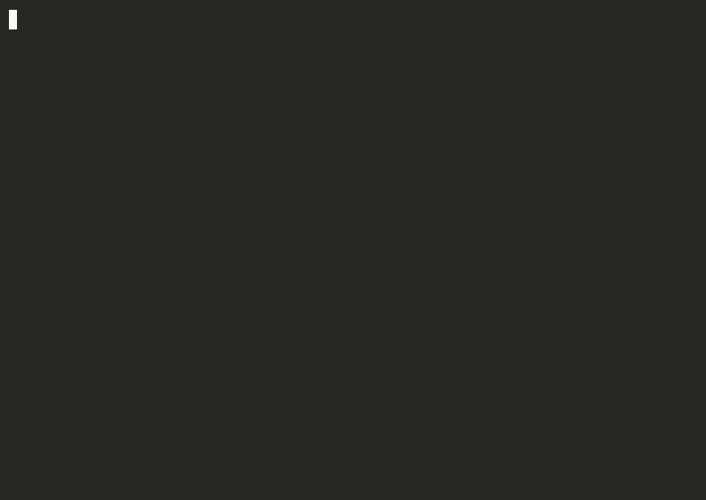

# model-orchestrator

[](https://www.npmjs.com/package/model-orchestrator) [](https://github.com/aunysillyme/model-orchestrator/actions/workflows/test.yml) [](LICENSE) [](package.json)

**A model orchestrator that sends every task to the smallest model that can do it,** so small work goes to cheap tiers and fewer tokens go to frontier models. One command reads which AIs you actually have, then writes the routing rules, the subagents and the lane runner for exactly that set: Claude Code, Codex, Gemini, Grok, Qwen, Ollama.

```bash
npx model-orchestrator
```



Three questions, then 38 files. The same plan as text:

```text
Plan
  level    2 Intermediate
  access   claude-code, codex, grok
  primary  claude-code
  tools    codecalc
  folder   ./ai-orchestrator
  project  .                   (11 subagent files go here)
  files    38
  - ROUTING.md                        multi-lane decision tree
  - TIERS.md  DELEGATION_MATRIX.md    which lane, at what effort
  - TASK_BUNDLE.md                    the brief every delegation carries
  - protocols/                        build, propagate, gap-analysis, deep-research, and three more
  - [project] .claude/agents/          builder, deep-planner, code-reviewer, bulk-worker,
                                       live-researcher, reader, finding-verifier, done-verifier
  - [project] .claude/hooks/           route-gate, subagent-context, route-metrics
  - bin/cli-run.mjs  bin/lanes.json   the lane runner

--dry: nothing written.
```

Run it yourself, in any folder:

```bash
npx model-orchestrator --yes --level 2 --ais claude-code,codex,grok --primary claude-code --dir ./ai-orchestrator --project . --dry
```

The recording above comes from the published package under `asciinema`, rendered with `agg`: `bash scripts/record-demo.sh`.

- **What it is:** routing rules, subagent definitions and a CLI lane runner (`cli-run`) for the AI tools you already pay for.
- **Where it sits:** above the request layer. Your agent reads the rules and picks the lane, so the decision stays somewhere you can read, version and edit. Request-level routers and gateways sit underneath it.
- **Use it when:** you run more than one model or agent and want the expensive tier kept for planning and judgment.
- **For agents:** [`llms.txt`](llms.txt) summarizes the package and links every doc; [`AGENTS.md`](AGENTS.md) has the headless commands.

Built from a working system: the routing rules, the protocols and the lane runner here run in production every day, generalized so they transfer to any stack.

## The three levels


| Level | You have | You get |
|---|---|---|
| **1 · Beginner** | one LLM or one agent | tiers, task classification, the two build checkpoints, the protocols (build, propagate, gap analysis, deep research, numbers and logic, memory and record, docs and proof), a task-bundle template, and your agent set up to follow them |
| **2 · Intermediate** | several AIs with CLIs | everything above, plus `cli-run` (exit 0 means a structurally accepted non-empty response; opt-in `--expect-file` / `--expect-json` for real contracts; `--model` / `--effort` to pin the route and log it), a delegation matrix generated from your selection, research triage across the lanes you have |
| **3 · Advanced** | a virtual machine | everything above, plus a gateway config rendered from the API keys you hold (asked separately from your CLIs), pinned images, box rules, privacy gates, and a weekly gap-analysis job with "what watches it" written down |

Levels explained: [Part 1](docs/part-1-beginner.md) · [Part 2](docs/part-2-intermediate.md) · [Part 3](docs/part-3-advanced.md).
## The AIs it knows about

| Id | What | Level |
|---|---|---|
| `claude-code` | Claude Code CLI, the default orchestrator | 1+ |
| `codex` | Codex CLI on a ChatGPT plan: second coder and second-opinion reviewer (a different model family reading your diff) | 1+ |
| `agy` | Antigravity CLI on a Google AI plan: research sweeps, concurrent fan-out | 1+ |
| `grok` | Grok CLI on X Premium: live X and web reads at $0 | 1+ |
| `hermes` | Hermes Agent: the free tier | 2+ |
| `qwen` | Qwen Code CLI with a cheap metered model: structured bulk | 2+ |
| `ollama` | local models: the privacy lane | 2+ |
| `claude-app`, `chatgpt-app`, `gemini-app` | chat apps with no CLI: level 1 via a paste block | 1 |

`npx model-orchestrator --list` prints the catalog with install and sign-in notes. Details: [docs/catalog.md](docs/catalog.md).

## Measuring routing

A routing rule nobody measures is a rule nobody knows is followed. On a claude-code install, `route-metrics.mjs` turns every turn, dispatch and subagent start/stop into one JSON line under `~/.ai-orchestrator/route-metrics.jsonl`, including the lane your agent named in its own `<!-- route: <lane> | <why> -->` marker.

```bash
node .claude/hooks/route-metrics.mjs --summary                        # since the log began
node .claude/hooks/route-metrics.mjs --summary --since 2026-09-01     # since a date
```

The report prints turns, **route-marker coverage** (the share of turns that carried a real lane, which answers "is the agent actually tagging its routing decisions?"), **work sent off the main session**, lanes by count, dispatches by `subagent_type`, and mean/max duration per agent type. The log holds exactly five things: a timestamp, the event, the session id, the lane name and the agent type. Every turn keeps running whatever the hook does, so the worst case is a quieter report.

## Claude Code plugin

The hooks and subagents also ship as a plugin, so they install and update through Claude Code itself:

```
/plugin marketplace add aunysillyme/model-orchestrator
/plugin install model-orchestrator@model-orchestrator
```

It ships the three hooks and the eight subagents, each with an explicit tool list, and loads them namespaced as `model-orchestrator:builder`. The routing rules come from `npx model-orchestrator`, which is the step that reads your setup and writes rules to match it. `plugin/` is generated from `templates/`, and `test/plugin.test.js` holds the bundle to that shape: committed output matches the generator, hooks stay read-only, every agent keeps its tool list. Details: [plugin/README.md](plugin/README.md).

## Companion tools (all optional)

An orchestrator routes work. Three companion tools cover the rest of what a working agent needs, exact numbers, a memory, and current library docs:

| Tool | Closes | Default |
|---|---|---|
| [codecalc](https://github.com/The-40-Thieves/codecalc) | guessed numbers: exact arithmetic, code execution in 31 languages, logic checks; offline, no key | yes |
| [obsidian-tc](https://github.com/The-40-Thieves/obsidian-tc) | no durable memory: hybrid search, backlinks, compare-and-swap writes; local by default | no |
| [Context7](https://github.com/upstash/context7) | stale library recall: current, version-specific docs pulled into the prompt | no |

Selecting one writes a doc and the config snippets for your agents, so the install stays yours to run. What each needs first, and how Context7 and codecalc pair up (docs say what an API should do, a run proves what it does): [docs/companions.md](docs/companions.md). Every level carries the three rules they serve either way: `protocols/numbers-and-logic.md`, `protocols/memory-and-record.md` and `protocols/docs-then-prove.md`.

## Principles the whole thing rests on

1. **Route by capability tier, not model name.** Default down, escalate on evidence.
2. **A gate you cannot fail is not a gate.** Every checkpoint is a question that can come back wrong.
3. **Exit 0 is not a deliverable.** Check for the artifact, not the status line. `cli-run` checks the response is structurally there; `--expect-file` checks the artifact.
4. **Numbers are computed, never guessed.** A tool that calculates beats a model that feels finished.
5. **A write nobody can find again did not happen.** Search first, keep the index true, one writer.
6. **A delegate's brief carries this task's scope, whatever it already holds.** A Claude Code subagent loads the project's CLAUDE.md hierarchy at start, so it already has the standing rules; a second CLI or a fresh chat window may hold none of them. Either way, only the brief carries what this task needs. On claude-code, that changes who executes: see "Who builds" in `ROUTING.md`.
7. **Only one process holds keys.** Names in the environment, values in a secrets manager, never in a file here.

## Common questions

### How do I cut token usage across Claude Code, Codex and Gemini?

Install for the tools you have, then let the generated `ROUTING.md` decide the tier per task: bulk, reading and verification go to the fast tier or a cheaper CLI lane, and the deep tier only plans and judges. On Claude Code, execution goes to the `builder` subagent by default and the main session plans and verifies. Every lane call through `cli-run` logs the model and effort it ran with, so you can check where the tokens went.

### How do I route tasks to cheaper models?

The rules route by role, complexity and stakes (see [Routing by role, complexity and stakes](#routing-by-role-complexity-and-stakes)). Role picks the agent, complexity moves the effort, stakes move the tier. A task a cheap tier finishes correctly stays on the cheap tier, and the frontier tokens go to the work that earns them.

### Where does this sit next to an LLM router or an AI gateway?

One layer up, and they compose. This routes at the task level, through instructions your agent follows and a runner for agent CLIs. Request-level routers and gateways (RouteLLM, LiteLLM, OpenRouter, claude-code-router) forward the model on every API call, and they sit underneath this happily: pick the lane here, let the gateway carry the call.

### Can an agent install and run it without a person?

Yes. `--yes` with `--level`, `--ais` and `--project` runs headless, `--dry-run` previews the plan, and `--list` prints every supported AI. Your existing files stay as they are: activation snippets land beside them, ready to merge when you choose.


## Read next

| Doc | What is in it |
|---|---|
| [docs/install.md](docs/install.md) | every flag, the two folders a run writes to, headless examples, the full file list |
| [docs/how-it-routes.md](docs/how-it-routes.md) | role, complexity and stakes; the three verifier agents; pinning a lane's model and effort |
| [docs/guarantees.md](docs/guarantees.md) | what is enforced by code, what is delegated to a vendor flag, and what is only an instruction |
| [docs/part-1-beginner.md](docs/part-1-beginner.md) · [Part 2](docs/part-2-intermediate.md) · [Part 3](docs/part-3-advanced.md) | the thinking behind each level |
| [docs/catalog.md](docs/catalog.md) | every supported AI with install and sign-in notes |

<details>
<summary><strong>Platform support, and every test this suite skips</strong></summary>


Node 18 or newer. No dependencies. Works on macOS and Linux; the level 3 box templates assume Ubuntu. Windows: CI runs the suite on `windows-latest` (Node 18, 20, 22), including lane execution end to end through `cli-run` against a fake CLI installed the same way npm installs a real one (a `.cmd` shim). `cli-run` never runs a lane through `cmd.exe` when it can avoid it: it resolves the shim to the Node script underneath and spawns Node directly, so a prompt reaching a real lane never passes through a Windows shell. A `.cmd` or `.bat` lane that cannot be resolved that way (an old or hand-edited shim) is refused with exit 13 and a message saying how to fix it, rather than run through `cmd.exe`: a batch file re-reads its arguments after `cmd.exe` has parsed them once, and no escaping fully contains a prompt through both passes. Install, detection, the hooks and `cli-run`'s `taskkill` tree kill are tested on Windows too, including SIGTERM/SIGINT to the wrapper (Windows has no OS-level signals: both terminate it unconditionally, verified there rather than treated the same as POSIX). Five narrow skips remain on Windows, each for a POSIX behavior the OS or the CI shell genuinely does not have, and each named here because a test that is quietly skipped reads as a test that passed: `statSync().mode`'s executable bit (NTFS has none, so that one assertion is conditional inside a test that otherwise runs everywhere); a lane dying mid-run from a real POSIX signal (a real Windows lane cannot die "by signal"); running `weekly-audit.sh`'s watchdog functions for real under Git Bash's job control, both the end-to-end run and the `bounded()` timeout check (the script itself only ever runs on the Ubuntu box it targets); and a `mkfifo` FIFO at the rules path, the one case that proves `route-gate.mjs` cannot HANG on a non-regular file, since Windows has no `mkfifo` to build one (the guard behind it is covered on every OS by a directory at the same path); and an untracked `mkfifo` FIFO in the repository `cli-run --audit` sizes, the case that proves `--effort auto` never opens a non-regular file (the symlink half of that test runs on every OS). The list is not prose on trust: `test/prose.test.js` counts every `skip:` in the suite and fails if one of them is not documented here.

**Privacy.** The installer sends no telemetry and makes no network call of its own once it is running. Two things around that are worth being exact about:

- `npx model-orchestrator` is itself a download: npm fetches this package from the registry before any of it runs. `npm install -g model-orchestrator` once, then run `model-orchestrator`, if you would rather that happen exactly one time.
- A missing vendor CLI is *printed*, not installed. In an interactive run the installer offers to run one pinned `npm install -g` per package and only runs the ones you answer yes to; with `--yes` or `--no-install` it answers no for you and prints the command instead. Vendor shell installers (Antigravity, Grok) are only ever printed, alongside the `curl … | less` you would use to read one before running it.

`cli-run` talks to nothing but the vendor CLI you name.


</details>

<details>
<summary><strong>Vendor version compatibility</strong></summary>


**This package detects that a binary exists. It does not check its version, and a present binary is not a working lane.** `--doctor` reports presence, and with `--run` sends one lane a one-word canary; neither validates that the vendor's flags, output shape or auth still match what the generated files assume.

The lane wiring and the output judges were written against these versions, which are the ones this release was exercised on:

<!-- vendor-table:start -->

| Lane | Vendor | Version this release was built against | Where that number is proved |
|---|---|---|---|
| `claude` | Anthropic | 2.1.226 | the npm pin the installer writes, `@anthropic-ai/claude-code@2.1.226` |
| `codex` | OpenAI | 0.153.4 | `test/fixtures/codex-0.153.4.jsonl`, a recorded run |
| `agy` | Google | 1.1.27 | `test/fixtures/agy-1.1.27.jsonl`, a recorded run |
| `grok` | xAI | 1.0.5 | `test/fixtures/grok-1.0.5.json`, a recorded run |
| `hermes` | Nous Research | 0.20.0 | `test/fixtures/hermes-0.20.0.txt`, a recorded run |
| `qwen` | Alibaba | 0.22.3 | `test/fixtures/qwen-0.22.3-nokey.json`, a recorded run |
| `ollama` | Ollama | 0.33.3 | the pinned image the level 3 box runs, `ollama/ollama:0.33.3` |

Generated from `src/catalog.js` by `npm run gen:catalog`; `npm test` fails if this table and the catalog disagree. Fixtures were captured 2026-09-06.

<!-- vendor-table:end -->

One number per lane, and it is the same number the installer pins: where a lane installs from npm, `builtAgainst` in the catalog *is* the pin, so "built against" and "pinned to" can never be two answers. That pin is a floor, not a ceiling: these CLIs ship breaking flag changes on their own schedules, so a newer version may work perfectly, or may change a flag the generated wiring passes. When a lane starts failing after a vendor upgrade, compare against this table first.

**The live canary runs on your machine, with your credentials.** That is what `node bin/cli-run.mjs --doctor --run` is: it sends every enabled lane one tiny prompt through your own sign-ins and reports `canary ok` or `canary FAILED rc=` per lane. Run it after install, and again after any vendor upgrade.

It deliberately does not run in this repository's CI. A canary is only meaningful against real credentials, and there are no credentials a maintainer could supply that would tell **you** anything about **your** lanes: your sign-ins, your quota, your vendor versions. A maintainer-credential canary in CI would prove one machine works and bill someone per run to do it. So CI runs the full suite against stub lanes on Ubuntu, macOS and Windows, Node 18/20/22, plus a packaged install into a clean consumer, and the live check ships to you instead.


</details>

## Contributing

Add an AI to `src/catalog.js` and every prompt, table, config and doc picks it up. Run `npm test`. Keep templates free of logic and free of anything that looks like a credential. The rest is in [CONTRIBUTING.md](CONTRIBUTING.md); releases in [RELEASING.md](RELEASING.md); security reports in [SECURITY.md](SECURITY.md).

## Credits

- [@shawnwows](https://x.com/shawnwows) reviewed the router and made the case for separating role, complexity and stakes instead of compressing them into one scale, for recording the model and effort a lane was actually asked for, and for verifying findings before they trigger repairs. All three shipped in 0.1.14.

## License

[MIT](LICENSE)
