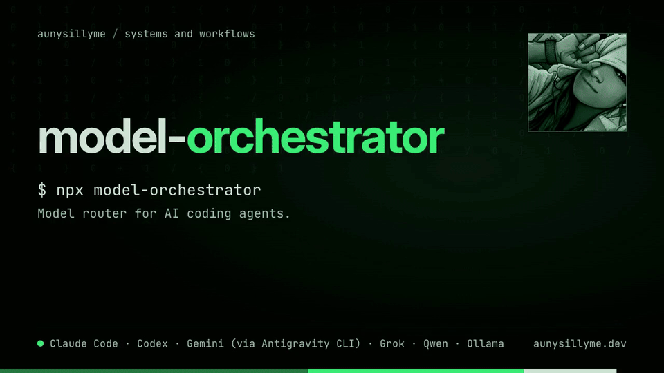

# model-orchestrator

[](https://www.npmjs.com/package/model-orchestrator) [](https://github.com/aunysillyme/model-orchestrator/actions/workflows/test.yml) [](LICENSE) [](package.json)

**Model router for AI coding agents: installs routing rules, 8 subagents, hooks and a CLI runner so your AI picks model and effort per task and saves tokens.**

Routine work can use a cheap model. Planning and difficult decisions can use a stronger one. Your agent gets editable rules for making that choice and a runner that checks whether delegated work returned a result.

A **lane** is one AI tool or model your agent can hand work to. A **tier** describes a model's strength and cost: planning model, working model or cheap model.

```bash
npx model-orchestrator
```



## What the model router gives you

| Part | What you get |
|---|---|
| Routing rules | A decision tree for bulk work, reading, live data, review, verification, planning and builds |
| Subagents and hooks | Named jobs with explicit tools, plus routing reminders inside Claude Code |
| Step-by-step playbooks (protocols) | A build process from acceptance checks through independent review and verified use |
| Task brief and context file | One shared set of facts, plus each worker's scope, permissions and checks |
| Lane runner | Honest exit codes, optional file or JSON checks, requested model and effort recorded per run |
| Routing metrics | Your local routing split and subagent activity |

The package sits **above the request layer**: your agent reads the rules and picks the lane. Request-level proxies and gateways can carry the API calls underneath it. `aunx route` prints a deterministic suggestion for your agent to consider.

**For agents:** [llms.txt](llms.txt) links the reference docs; [AGENTS.md](AGENTS.md) gives headless commands.

Preview a setup:

```bash
npx model-orchestrator --yes --level 2 --ais claude-code,codex --primary claude-code --project . --dir ./ai-orchestrator --dry
```

## After you install

1. **Rules:** copy `ai-orchestrator/CLAUDE.snippet.md` into your project's `CLAUDE.md`.
2. **Hooks:** merge `ai-orchestrator/settings.hooks.snippet.json` into `.claude/settings.json`.
3. **Verification:** run `node ./ai-orchestrator/bin/cli-run.mjs --doctor`, or `aunx cli-run --doctor` when the command is installed.

`--apply-snippets` applies those Claude Code activation steps with timestamped backups and preserves surrounding rules and settings. Preview with `--apply-snippets --dry`. Start a fresh Claude Code session from the project folder, then follow the printed sign-in steps. [Installation and upgrades](docs/install.md) cover every flag.

Install the command once to use the shorter forms below:

```bash
npm install -g model-orchestrator
aunx --help
```

`aunx` without a subcommand runs the same installer as `model-orchestrator`. The installer writes only its own files. Every companion is opt-in, including with `--yes`; missing tools appear together under **Install these yourself**, with official commands and links.

## Part of a set

| Repo | What it gives you |
|---|---|
| [agent-personalizer](https://github.com/aunysillyme/agent-personalizer) | One interview writes the profile and rules every AI you use reads, kept in sync from one source. |
| **model-orchestrator** | Model router for AI coding agents: installs routing rules, 8 subagents, hooks and a CLI runner so your AI picks model and effort per task and saves tokens |
| [website-build-skill](https://github.com/aunysillyme/website-build-skill) | A skill pack that teaches your AI current website-building expertise: research, design, code, accessibility, performance, search and security. |

## Model routing and request-level proxies

An HTTP proxy or gateway such as LiteLLM, Portkey, OpenRouter or claude-code-router swaps the model per request underneath the agent. model-orchestrator is an installer that writes routing rules, subagents, hooks and a lane runner above the request layer.

- **Pick a proxy** for request-level model routing and a shared API entry point.
- **Pick model-orchestrator** for task delegation across your agents, model tiers and CLIs.

They compose: your agent follows the installed rules, and a proxy can route its API requests underneath.

## Choose the setup that fits your tools

| Level | Your setup | What it adds |
|---|---|---|
| Beginner | One agent or chat app | Task classification, model tiers, a task brief, acceptance checks and build protocols |
| Intermediate | Several AI CLIs | A lane runner, delegation matrix, research triage and model/effort flags |
| Advanced | An always-on Linux machine | Gateway templates, privacy rules and a scheduled review job |

Read [beginner](docs/part-1-beginner.md), [intermediate](docs/part-2-intermediate.md) or [advanced](docs/part-3-advanced.md).

## Works with the AIs you already pay for

Choose the tools you have; the generated rules describe that selection.

| AI | Installer ID | Setup |
|---|---|---|
| Claude Code | `claude-code` | Project rules, subagents and routing hooks |
| Codex | `codex` | CLI work and independent review |
| Antigravity | `agy` | CLI work and custom agents |
| Grok | `grok` | CLI work with live-data tools |
| Hermes | `hermes` | Headless CLI work |
| Qwen Code | `qwen` | CLI work with your chosen model |
| Ollama | `ollama` | Local models |
| Claude, ChatGPT and Gemini apps | `claude-app`, `chatgpt-app`, `gemini-app` | A routing block to paste into your chat app |

`npx model-orchestrator --list` prints supported IDs and setup notes. [The catalog](docs/catalog.md) lists installation, sign-in and detection details.

## Lane runner (`aunx cli-run`)

Run from your project. `aunx` prefers your installed `ai-orchestrator/bin/cli-run.mjs`; `--dir` selects another rules folder. It uses the package runner when the project has no installed copy.

```bash
aunx cli-run --doctor
aunx cli-run codex --brief TASK_BRIEF.md --effort high
# Direct form from the installed rules folder:
node bin/cli-run.mjs codex --brief TASK_BRIEF.md --effort high
```

`--doctor --run` sends a small live check through your own vendor sign-ins. Each run records the requested model and effort and a fixed result class in a local log. A missing result returns nonzero. Add `--expect-file` or `--expect-json` when success needs a concrete output contract. [Runner reference](bin/README.md).

## Task brief (`aunx brief`) and acceptance checks (`aunx checks`)

```bash
aunx context CONTEXT.md
aunx brief new TASK_BRIEF.md
aunx checks ACCEPTANCE_CHECKS.json
aunx checks run ACCEPTANCE_CHECKS.json
```

Fill the context file with verified facts, quote the user's ask in the brief, and give every requirement a check command. The check runner reports PASS or FAIL and exits 1 when a check fails. Run only check files you trust: their commands execute with your shell's permissions. See [the acceptance-check protocol](templates/common/protocols/acceptance-checks.md).

## Routing suggestions (`aunx route`)

```bash
aunx route "rename this file"
aunx route "design the auth system"
```

The first suggests cheap bulk work; the second suggests deep planning. The classifier uses keywords, explains its suggestion, and points ambiguous unmatched requests to `ROUTING.md`. It makes no model call and launches no worker.

## See where your agent sends work (`aunx route-metrics`)

```bash
aunx route-metrics --summary
aunx route-metrics --summary --since 2026-09-01
```

On Claude Code installs, the routing hook records turns, route markers and subagent activity locally. The summary reports your routing split, route-marker coverage and agent durations. Prompt text and the explanation inside a route marker never enter that log. [Measured results and reproduction scripts](proof/README.md) show dated figures with methods and sample sizes; expired entries fail the test suite.

## Claude Code plugin

```text
/plugin marketplace add aunysillyme/model-orchestrator
/plugin install model-orchestrator@model-orchestrator
```

The plugin carries read-only routing hooks and the subagents. Generate your project's routing rules with `npx model-orchestrator`. The npm installer also supplies the local metrics hook. [Plugin setup](plugin/README.md).

## Works well with

These are other authors' projects, maintained in their own repositories. All companions start unselected. Choosing one writes guidance and configuration snippets; you install and configure the tool yourself.

| Project | Author | What it adds |
|---|---|---|
| [codecalc](https://github.com/The-40-Thieves/codecalc) | The-40-Thieves | Local calculation, code execution and logic checks |
| [obsidian-tc](https://github.com/The-40-Thieves/obsidian-tc) | The-40-Thieves | Searchable notes and controlled writes over an Obsidian vault |
| [Context7](https://github.com/upstash/context7) | Upstash | Current, version-specific library documentation |

Use `--tools codecalc,obsidian-tc,context7` to select them. Without a companion, use your available calculator or runtime, a searchable notes folder and official library docs. [Companion setup and upstream support](docs/companions.md).

## Common questions

### What is a model router for coding agents?

It helps an agent match a task to a model, effort level and toolset. Run `npx model-orchestrator` to install editable rules, subagents and a CLI runner for your setup; your agent makes the routing decision.

### How do I use Claude Code and Codex together?

Run `npx model-orchestrator --yes --level 2 --ais claude-code,codex --primary claude-code --project . --dir ./ai-orchestrator`, then follow the activation summary. Claude Code can dispatch scoped work through `aunx cli-run codex --brief TASK_BRIEF.md` and use a different model family for review.

### How do I reduce Claude Code token usage?

Install routing rules with `npx model-orchestrator`, so your agent has guidance for sending routine work to cheaper models and keeping reads scoped. Use `aunx route-metrics --summary` to measure where your work goes; savings depend on your tasks and model choices.

### How do I route tasks to cheaper models?

Use `aunx route "rename this file"` for a keyword-based suggestion, then apply your installed `ROUTING.md` and `TIERS.md` to the actual task. Role selects the job, complexity sets effort, and the consequences of a mistake affect the model and reviewer.

### How does this work with an AI gateway or LLM router?

It coordinates multi-agent work at task level; a proxy such as LiteLLM or OpenRouter can route the API requests underneath it. `npx model-orchestrator --level 3` includes gateway templates when you want that setup.

### How does an agent install and run it headlessly?

Pass `--yes --level 2 --ais claude-code,codex --project . --dir ./ai-orchestrator` to `npx model-orchestrator`; add `--dry-run` to preview. Existing edits are preserved by default, and `--update-docs` refreshes files whose installed hashes still match.

## Uninstall

Run `npx model-orchestrator --uninstall --dir ./ai-orchestrator --project .` (add `--dry` to preview). The installer removes unedited managed files and names edits it keeps. Remove the pasted rules and merged hook entries using the printed manual steps. [Removal details](docs/install.md#uninstall).

## Read next

- [Install and upgrade](docs/install.md): flags, folders, walkthrough and safe reruns.
- [How routing works](docs/how-it-routes.md): model, effort and independent verification.
- [Guarantees](docs/guarantees.md): executable checks and agent instructions.
- [Proof](proof/README.md): dated measurements and scripts you can rerun.
- [Security review history](docs/security-review-history.md): findings, fixes and regression evidence.

<details>
<summary><strong>Platform support, and every test this suite skips</strong></summary>


Node 18 or newer, with zero runtime dependencies. Works on macOS and Linux; the level 3 box templates assume Ubuntu. Windows: CI runs the suite on `windows-latest` (Node 18, 20, 22), including lane execution end to end through `cli-run` against a fake CLI installed the same way npm installs a real one (a `.cmd` shim). `cli-run` never runs a lane through `cmd.exe`: it resolves the shim to the Node script underneath and spawns Node directly, so a prompt reaching a real lane never passes through a Windows shell. A `.cmd` or `.bat` lane that cannot be resolved that way (an old or hand-edited shim) is refused with exit 13 and a message saying how to fix it, rather than run through `cmd.exe`: a batch file re-reads its arguments after `cmd.exe` has parsed them once, and no escaping fully contains a prompt through both passes. Install, detection, the hooks and `cli-run`'s `taskkill` tree kill are tested on Windows too, including SIGTERM/SIGINT to the wrapper (Windows has no OS-level signals: both terminate it unconditionally, verified there rather than treated the same as POSIX). The Windows skip list covers POSIX behavior, with each skip pinned by `test/prose.test.js`: `statSync().mode`'s executable bit (NTFS has none, so that one assertion is conditional inside a test that otherwise runs everywhere); a lane dying mid-run from a real POSIX signal (a real Windows lane cannot die "by signal"); running `weekly-audit.sh`'s watchdog functions for real under Git Bash's job control, both the end-to-end run and the `bounded()` timeout check (the script itself only ever runs on the Ubuntu box it targets); and a `mkfifo` FIFO at the rules path, the one case that proves `route-gate.mjs` cannot HANG on a non-regular file, since Windows has no `mkfifo` to build one (the guard behind it is covered on every OS by a directory at the same path); and an untracked `mkfifo` FIFO in the repository `cli-run --audit` sizes, the case that proves `--effort auto` never opens a non-regular file (the symlink half of that test runs on every OS). `test/prose.test.js` counts every `skip:` in the suite and requires this list to document each one.

**Privacy.** The installer sends no telemetry and makes no network call of its own once it is running. Two things around that are worth being exact about:

- `npx model-orchestrator` is itself a download: npm fetches this package from the registry before any of it runs. `npm install -g model-orchestrator` once, then run `model-orchestrator`, if you would rather that happen exactly one time.
- Every missing vendor CLI or selected companion is listed under **Install these yourself**, with an official command and link. The installer runs no third-party installs. `--no-install` remains accepted for existing scripts.

`cli-run` calls the vendor CLI you name.


</details>

<details>
<summary><strong>Vendor version compatibility</strong></summary>


**Detection checks whether a binary is present.** Use the compatibility table below to compare vendor versions. `--doctor` reports presence; add `--run` to send a small canary to every enabled worker and check its sign-in and output against the runner's success criteria.

The lane wiring and the output judges were written against these versions, which are the ones this release was exercised on:

<!-- vendor-table:start -->

| Lane | Vendor | Version this release was built against | Where that number is proved |
|---|---|---|---|
| `claude` | Anthropic | 2.1.226 | the npm pin the installer writes, `@anthropic-ai/claude-code@2.1.226` |
| `codex` | OpenAI | 0.153.4 | `test/fixtures/codex-0.153.4.jsonl`, a recorded run |
| `agy` | Google | 1.1.27 | `test/fixtures/agy-1.1.27.jsonl`, a recorded run |
| `grok` | xAI | 1.0.5 | `test/fixtures/grok-1.0.5.json`, a recorded run |
| `hermes` | Nous Research | 0.20.0 | `test/fixtures/hermes-0.20.0.txt`, a recorded run |
| `qwen` | Alibaba | 0.22.3 | `test/fixtures/qwen-0.22.3-nokey.json`, a recorded run |
| `ollama` | Ollama | 0.33.3 | the pinned image the level 3 box runs, `ollama/ollama:0.33.3` |

Generated from `src/catalog.js` by `npm run gen:catalog`; `npm test` fails if this table and the catalog disagree. Fixtures were captured 2026-09-06.

<!-- vendor-table:end -->

For npm-installed lanes, `builtAgainst` in the catalog supplies both the compatibility table and the install pin. Newer vendor versions may work or may change a flag the generated wiring uses. When a lane starts failing after a vendor upgrade, compare against this table first.

**The live canary runs on your machine, with your credentials.** That is what `aunx cli-run --doctor --run` (direct form: `node bin/cli-run.mjs --doctor --run`) is: it sends every enabled lane one tiny prompt through your own sign-ins and reports `canary ok` or `canary FAILED rc=` per lane. Run it after install, and again after any vendor upgrade.

CI runs the full suite against stub lanes on Ubuntu, macOS and Windows, Node 18/20/22, plus a packaged install into a clean consumer. Run the live check locally to verify your own sign-ins, quota and vendor versions.


</details>

## Contributing

Contributions are welcome:

- **New AIs:** add an entry to `src/catalog.js`; prompts, tables, configs and docs use the catalog.
- **Vendor updates:** contribute a lane fixture captured from a newer vendor version and the test that checks it.
- **Docs:** fix an unclear instruction or add a reproducible example.

Run `npm test` with your change. Keep templates free of logic and credential values. See [CONTRIBUTING.md](CONTRIBUTING.md), [RELEASING.md](RELEASING.md) and [SECURITY.md](SECURITY.md).

## Credits

- [@shawnwows](https://x.com/shawnwows) reviewed the router and made the case for separating role, complexity and stakes instead of compressing them into one scale, for recording the model and effort a lane was actually asked for, and for verifying findings before they trigger repairs. All three shipped in 0.1.14.

## License

[MIT](LICENSE)
