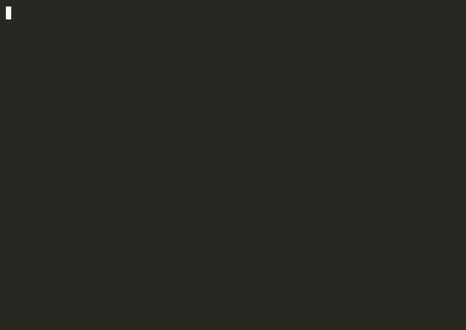

# Installing

Everything the installer asks, writes and accepts as a flag. The short version is in the [README](../README.md).

## Install walkthrough



This recording shows the published 0.1.x installer. Version 1.0 detects your tools and asks for one confirmation. Companions start unselected, and third-party installation instructions are printed for you to run. Re-record from the published release with `bash scripts/record-demo.sh`.

## What a run does


The installer detects the AI binaries on your PATH, proposes a setup and shows **Your stack: who does what** before writing. The default flow asks exactly one question:

```text
Write these files?
[Y/n/e]  (e to change anything above):
```

- **Confirm:** press Enter or `y` to write the displayed files and apply the displayed project activation changes. Existing files changed outside the rules folder get backups. `n` exits without writing.
- **Edit:** enter `e`, choose one setting and return to the summary. The edit menu includes activation, level, AIs, main agent, companions, paths and plans; level 3 also includes API providers. Turn activation off here or pass `--no-apply`.
- **No detected tools:** answer "Which AIs do you have access to?" first, then confirm. This path asks two questions.
- **Defaults:** one selected tool starts at level 1; several tools including a supported worker start at level 2, subject to each tool's minimum level. Level 3 requires an explicit choice. Companions and API providers start unselected.
- **Main agent:** capability ranking prefers project-rule-loading subagents, then an agent-definition surface, then a CLI with a project rules file. Ties keep selection order.
- **Overrides:** explicit flags take precedence and appear in the plan. Existing recorded plans and automatic-effort consent survive a rerun.

The installer never writes a secret, runs no third-party installer, and preserves existing documents by default. `--force` explicitly replaces them. Interactive activation updates the main agent's project rules and supported settings with backups; `--yes` requires `--apply-snippets` for those changes. The summary lists every project file it will change before confirmation.

`MANIFEST.json` and `bin/lanes.json` are machine-owned and refreshed on every run. Runtime files upgrade when their content matches the previous installed hash; edited or unverifiable copies stay and are named. `--upgrade-runtime` replaces runtime files only. `--update-docs` applies the same hash check to generated documents, preserving your edits. Docs and protocols go to `--dir` (default `./ai-orchestrator`). Supported subagent definitions and Claude Code hook scripts go to `--project` (default the current directory); their locations appear in the summary.

Every non-dry install runs a compact local health check. The final **What's left for you** section lists remaining actions, such as sign-ins or a chat app's paste step, and says when nothing remains. The generated `README.md` explains activation for the selected main agent and level. [Uninstall](#uninstall) removes recorded activation changes as well as unedited managed files.

The manifest's `roles` assignment is refreshed on every run. If a changed assignment leaves edited documents in place, the installer names that difference: `aunx route` uses the current manifest while those documents retain your edits. Use `--update-docs` to regenerate unchanged managed documents.

## Project activation

Interactive installs apply activation by default as part of the one confirmation. Turn it off with `--no-apply` or the edit screen. Headless `--yes` preserves 0.1.x behavior: add `--apply-snippets` to apply activation; without it, project rules and settings remain untouched.

- **Rules:** the catalog selects the main agent's project rules file: `CLAUDE.md`, `AGENTS.md`, `GEMINI.md` or `QWEN.md`. A block between `<!-- model-orchestrator:start -->` and `<!-- model-orchestrator:end -->` is created or replaced in place, keeping every byte outside it. Incomplete or duplicate markers are refused before writing.
- **Hooks:** a Claude Code main agent gets its generated hooks merged into `.claude/settings.json`, preserving existing keys and hooks. A command with the same arguments already present in that event is kept once. Invalid JSON exits 2, names the file and writes nothing.
- **Companions:** a Claude Code main agent gets selected tools registered in the project's `.mcp.json` when activation is enabled. Existing settings and server names stay; a conflicting server entry becomes a printed step. Other main agents retain manual registration steps because the catalog has no verified project config target for them. `obsidian-tc` also needs your actual configuration path. No global config is changed.
- **Backups:** existing files changed during application get sibling `<name>.bak-YYYYMMDDTHHMMSS` backups, including generated files replaced on a rerun. Each path is printed; unchanged and newly created files need no backup. Existing backups are preserved.
- **Preview:** `--dry` and `--dry-run` list the proposed writes and backups without changing files or running the health check. For a headless activation preview, pass `--yes --apply-snippets --dry` with your selection and paths.
- **Manual surfaces:** a chat app keeps one paste step. A main agent without a catalog-supported project rules file keeps its instruction step. `--no-apply` leaves the relevant rules, hook and companion merge steps in the final list.
- **Removal:** the manifest records the applied block and added hook and MCP entries. Uninstall removes unchanged owned entries and preserves surrounding content, existing entries and backups. Edited owned content is kept and named for review.

```bash
npx model-orchestrator --yes --level 2 --ais claude-code,codex --primary claude-code --project . --dir ./ai-orchestrator --apply-snippets
```

## Health check and sign-in

Every non-dry install runs the existing runner's `--doctor` presence check automatically, with no network or prompt sent. A missing CLI is reported alongside its installation command; the installer never runs that command. `--doctor --run` remains an explicit live check through your own vendor sign-ins.

Sign-in status is checked only when the catalog records a reliable command. Codex uses `codex login status`; a confirmed session removes its sign-in from **What's left for you**, and a confirmed sign-out prints a direct "sign in to Codex" step. Claude Code uses `claude auth status` and trusts only a confirmed sign-in the same way, but never a confirmed sign-out: an author-machine probe found a working, signed-in session that still reports a JSON sign-out, so any result other than a confirmed sign-in keeps the conditional "if you have not signed in yet" step for Claude Code. Every other CLI gets that same conditional step followed by its sign-in instruction. The installer never runs a login flow.

Start a fresh agent session in the displayed project to load the installed rules. For a later presence check, use `aunx cli-run --doctor`, or at level 2 and up `node ./ai-orchestrator/bin/cli-run.mjs --doctor` with your chosen rules path.

## Plans and automatic effort

State known subscription plans with `--plans codex=pro-20x,agy=ultra-5x`, or choose subscription plans from the edit menu. The generated guidance uses plan headroom to allocate volume only. Every catalog plan currently has an unverified model mapping, so agent definitions omit `model:` and use your tool's configuration. Probe the available models before dispatching work. Claude Code also honors `CLAUDE_CODE_SUBAGENT_MODEL`; a manual `model:` line can set a verified choice. Plan support for `xhigh` and `max` effort remains UNVERIFIED.

`--effort-auto` is explicit consent to set `auto` only for selected high or max headroom CLI lanes. Auto chooses medium below 4,000 prompt characters and high otherwise, never higher. An audit lane may impose its own effort floor; check its configuration. Name `xhigh` explicitly for security-critical or irreversible work. The default install skips plan and effort questions; choosing plans in the edit menu enables the effort choice in that same step.
## The two folders every run writes to

An install has two targets, and a scripted run should set both.

| Flag | Default | What lands there |
|---|---|---|
| `--dir` | `./ai-orchestrator` | the docs, protocols and (level 2+) `bin/cli-run.mjs`. Named after what it contains, not after this package, so a project can hold one without looking like a checkout of it. Pass `--dir ./model-orchestrator` if you prefer the package name. |
| `--project` | the current directory | the main agent's supported subagent definitions: `.claude/agents/` for Claude Code or `.agents/agents/` for Antigravity; Claude Code's hook scripts in `.claude/hooks/`. With activation enabled, the catalog-supported rules file, Claude Code's `.claude/settings.json` and selected companion entries in its `.mcp.json` are merged with backups. |

`--project` defaulting to the current directory is the one that surprises people: run the command from your home folder with Claude Code as the main agent and the subagent and hook files land in your home folder. The installer prints the resolved project path in the plan and says when you left it at the default. Set it.

Rules inside the project use project-relative snippet paths, so moving the whole project preserves them. Rules outside the project use absolute paths and carry a relocation note. After moving those rules, re-run the installer or set `MODEL_ORCHESTRATOR_RULES_DIR` for the installed rule-reading hooks, and update your agent instruction paths. An absolute override names the new folder; a relative override is relative to `CLAUDE_PROJECT_DIR`. `route-metrics` reads no rules and keeps its home-directory log. The separately installed Claude Code plugin keeps its existing default-path lookup.

## Headless installation

`--yes` requires both `--level` and `--ais`, giving scripted installs an explicit selection. It never prompts and applies project activation only with `--apply-snippets`. Detection-based inference applies to the interactive flow. All existing flags remain available, including `--primary`, `--tools`, `--plans`, `--apis`, `--no-tools` and `--no-install`.

```bash
# both targets set: docs in ./ai-orchestrator, subagents into ./my-app/.claude/agents
npx model-orchestrator --yes --level 2 --ais claude-code,codex,grok --primary claude-code \
  --dir ./ai-orchestrator --project ./my-app
# Companions default to none, including with --yes.
# Add --tools codecalc,obsidian-tc,context7 to write their guides and snippets.

npx model-orchestrator --yes --level 3 --ais claude-code,codex,agy,grok,hermes,qwen,ollama --apis anthropic,openrouter --dry   # print the plan, write nothing
npx model-orchestrator --yes --level 2 --ais claude-code,codex --project ~/my-app --dir ~/my-app/ai-orchestrator --no-tools  # subagents into ~/my-app/.claude/agents
npx model-orchestrator --yes --level 2 --ais claude-code,codex,grok --primary claude-code --dir ./ai-orchestrator --project . --update-docs   # added a lane: regenerate the docs you never edited
```

## Upgrading from 0.1.x

Use the same project and rules folder as your existing install. Preview first:

```bash
npx model-orchestrator@1 --yes --level 2 --ais claude-code,codex --primary claude-code --project . --dir ./ai-orchestrator --update-docs --dry
```

- **Documents:** `--update-docs` replaces only files matching their recorded installed hashes. The former brief filename migrates to `TASK_BRIEF.md` when unedited. An edited legacy brief stays and is named so you can move your changes deliberately.
- **Runtime:** unchanged managed runtime files upgrade automatically. Use `--upgrade-runtime` when you intend to replace an edited runtime; it leaves document edits alone.
- **Companions:** existing codecalc guides and snippets stay managed. New installs select none unless you pass `--tools`. `--uninstall` still removes companion files only when unedited.
- **Activation:** interactive reruns apply the main agent's catalog-supported project rules and settings with backups; turn this off with `--no-apply`. Headless reruns require `--apply-snippets` for activation changes.
- **Compatibility:** every 0.1.x installer flag remains accepted. `--no-tools` and `--no-install` remain accepted for older scripts.
- **Verification:** remove `--dry` to apply. The health check runs automatically; start a fresh agent session to load the updated rules.

The installer writes its own files and the displayed project activation changes. Missing selected CLIs and companions appear in one **Install these yourself** block with official commands and links.

## Uninstall

Use the same `--dir` and `--project` paths you installed with. The uninstall reads `MANIFEST.json` under `--dir` and checks every recorded path before removing any file.

```bash
# Preview the exact removals and kept files.
npx model-orchestrator --uninstall --dir ./ai-orchestrator --project ./my-app --dry
# Remove the files whose content still matches the recorded hash.
npx model-orchestrator --uninstall --dir ./ai-orchestrator --project ./my-app
```

- **Unedited files:** removed when their content hash matches the manifest.
- **Edited files:** kept and listed by path, with the manifest retained so you can review them.
- **Applied activation:** an unchanged recorded rules block and the exact hook or MCP entries added by the installer are removed. Existing entries and surrounding content stay. An edited owned entry stays and is named; the manifest remains for a later retry.
- **Backups:** existing project files changed during cleanup get backups. Timestamped backups stay for a reviewed restore.
- **Other files:** anything outside the manifest stays, including your own files in shared `.claude/agents/` and `.claude/hooks/` folders.
- **Directories:** removed only when the manifest records that the installer created them and they are empty after removal. Older manifests leave directories in place because they carry no directory ownership record.
- **Manifest:** removed last, only when every managed file has been removed.
- **Path safety:** an absolute path, traversal entry, or symlink is refused before any removal. Entries must stay inside their declared `--dir` or `--project` root.
- **Global configuration:** installation and uninstall refuse home-level agent rules and global agent folders such as `~/.claude` and `~/.codex`. Choose a project directory below your home folder for project activation.
- **Missing manifest:** exits 2 and names the expected `MANIFEST.json` path.
- **Target paths:** `--dir` and `--project` must match the installation paths in the manifest. A mismatch exits 2 before removal.
- **Preview:** `--dry` (or `--dry-run`) lists the planned removals and writes nothing.

Manually pasted activation from an older install has no ownership record, so the command prints its cleanup steps. Applied blocks use `<!-- model-orchestrator:start -->` and `<!-- model-orchestrator:end -->`. Review any retained entry or backup before changing it so later edits survive.

## What gets written (level 3, everything)

The tree shows the activation alternatives. Each install writes the main agent's snippet and its supported agent set; companion files appear when selected. Paths beginning with `<project>/` are relative to `--project`, separate from the rules folder.

```
ai-orchestrator/
  README.md                 start here, written for your level and your AIs
  ORCHESTRATOR.md           single-agent routing rules (level 1)
  TASK_BRIEF.md            the brief every delegation carries
  CONTEXT.md               shared facts every delegation reads
  ACCEPTANCE_CHECKS.json   executable acceptance checks
  DECISIONS.md             the decision log: Did / Why / Serves / Rejected
  protocols/                acceptance-checks · build-protocol · context-file · decision-log · deep-research · docs-then-prove · gap-analysis · memory-and-record · numbers-and-logic · propagate
  CODECALC.md  OBSIDIAN-TC.md  CONTEXT7.md  mcp/   companion-tool install docs + per-agent registration snippets (if selected)
  CLAUDE.snippet.md         rules block for CLAUDE.md (Claude Code main agent)
  settings.hooks.snippet.json  hooks for .claude/settings.json (Claude Code main agent)
  GEMINI.snippet.md         rules block for GEMINI.md (Antigravity main agent)
  AGENTS.snippet.md         rules block for AGENTS.md (Codex main agent)
  QWEN.snippet.md           rules block for QWEN.md (Qwen Code main agent)
  PASTE-INTO-YOUR-AGENT.md  paste into instructions (main agent with no project rules file)
  ROUTING.md                multi-lane decision tree (level 2+)
  TIERS.md  DELEGATION_MATRIX.md  RESEARCH_TRIAGE.md  CLI-RUN.md
  bin/cli-run.mjs  bin/lanes.json          (aunx cli-run --doctor, or node bin/cli-run.mjs --doctor)
  vm/                       gateway config, compose, box rules, privacy gates, jobs/ (level 3)

<project>/.claude/agents/  Claude Code main agent's subagent set
<project>/.claude/hooks/   route-gate.mjs, subagent-context.mjs, route-metrics.mjs (Claude Code main agent)
<project>/.agents/agents/  Antigravity main agent's custom agent set
```

## Project commands (`aunx`)

Install the command with `npm install -g model-orchestrator`, then run these from your project. `aunx` without a subcommand accepts the installer flags.

| Command | Result |
|---|---|
| `aunx cli-run --doctor` | Check selected CLIs; add `--run` for live vendor canaries |
| `aunx route-metrics --summary` | Summarize your local routing history |
| `aunx brief` | Print the task brief template |
| `aunx brief new TASK_BRIEF.md` | Scaffold a task brief |
| `aunx context CONTEXT.md` | Scaffold a shared context file |
| `aunx checks ACCEPTANCE_CHECKS.json` | Scaffold executable acceptance checks |
| `aunx checks run ACCEPTANCE_CHECKS.json` | Execute trusted check commands; exit 1 on any failure |
| `aunx route [--dir PATH] "rename this file"` | Print the role, assigned AI, tier, effort and reason from your manifest |

`aunx cli-run` uses the packaged runner by default; pass `--dir PATH` to use that project's own installed runner under `PATH/bin/` instead, and `aunx` prints the runner path it is using. Review check commands before running them: they execute with your shell permissions.

`aunx route` reads `MANIFEST.json` first under `--dir`, then under `./ai-orchestrator`, then in the current folder. It reads regular JSON files of at most 1 MiB, refuses symlinks and executes no project code. A missing or invalid manifest gives the generic suggestion plus an install notice.

## Installer operation

The installer creates routing instructions and activates the supported project surfaces so you can start using them from a fresh agent session.

| Part | Operation |
|---|---|
| Trigger | Run `model-orchestrator`, `npx model-orchestrator` or `aunx` without a subcommand. The installer is a one-off command, with no schedule. |
| Invocation chain | `bin/cli.js` parses flags, detects tools, plans files and activation, shows the summary, obtains the interactive confirmation, writes the plan, runs the presence check and prints remaining actions. `--yes` skips confirmation; `--dry` stops before writes and checks. |
| Dependencies | Node 18 or newer; writable chosen target folders. Vendor CLIs and companions are detected locally and installed by you. |
| Reads | Catalog and templates, CLI presence, the previous manifest, existing project rules and settings, and reliable catalog-listed sign-in status. |
| Writes | Managed files under `--dir` and `--project`, the displayed project activation merges, ownership records in the manifest, and sibling backups for changed existing files. |
| Closed loop | The terminal reports written, preserved and applied files, health results and remaining actions. Nothing watches a completed install or retries it automatically. Start a fresh agent session to check that it loads the rules. |
| Failure modes | Invalid flags, refused paths, malformed activation markers or invalid JSON exit 2 before application. A missing CLI or unconfirmed sign-in is reported for manual setup. Edited managed files or activation entries are kept and named. Report a reproducible installer failure with its command and exit code to the repository's issue tracker. |
| Run and verify | Preview the headless example above with `--dry`; remove `--dry` to apply. Check the marked rules block, Claude Code's hook settings when selected, and the printed health result. Run `npm test` from the source checkout for fixture checks; use `aunx cli-run --doctor --run` only when you choose a live vendor check. |
| Source of truth | `bin/cli.js` owns the flow, `src/catalog.js` owns host capabilities, `src/install.js` owns planning and writes, `src/apply-snippets.js` and `src/apply-companions.js` own activation merges, `src/postinstall.js` owns presence and sign-in checks, and `src/uninstall.js` reads the manifest to remove owned content. |

The automatic presence check proves that configured binaries can be found. It does not prove authentication, a live response or that a new agent session loaded the rules; those checks require the corresponding vendor session.

## Repo layout

| Folder | What |
|---|---|
| [`bin/`](../bin/README.md) | `cli.js` (the installer), `aunx.js` (the CLI entry point) and `cli-run.mjs` (the lane runner) |
| [`src/`](../src/README.md) | the catalog, the pure planner, detection, rendering |
| [`templates/`](../templates/README.md) | everything the installer can write, by level, plus `tools/` for companions |
| [`docs/`](../docs/README.md) | the three parts and the catalog |
| [`plugin/`](../plugin/README.md) | the Claude Code plugin, generated from `templates/` by `npm run gen:plugin`; `.claude-plugin/marketplace.json` at the root lists it |
| [`proof/`](../proof/README.md) | the measured numbers behind the README's claims: method, sample size, date and expiry |
| [`test/`](../test/README.md) | `npm test`: judges proven to go red, catalog integrity, planner, end-to-end install in a temp dir; `.github/workflows/test.yml` runs it on Ubuntu, macOS and Windows, Node 18/20/22 |
