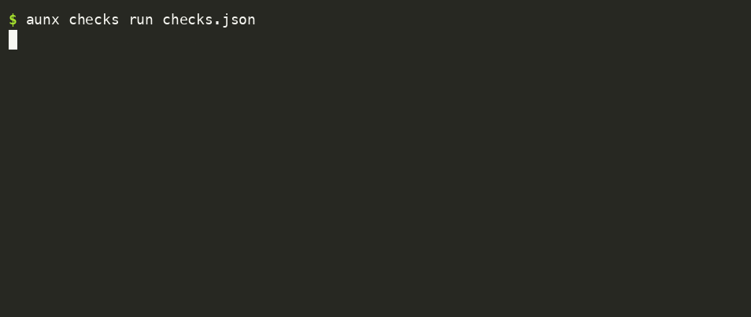

# Reproduce the measurements

Generated from [results.json](results.json). Each figure has a method, sample size, measurement date and expiry. Run the scripts on your own machine to compare.

Environment: Node v22.22.3, darwin arm64. Timing varies with startup caches and other work on the machine. Synthetic cases show what those fixtures exercise.

| Measurement | Result | Sample size | Measured | Expires | Reproduce |
|---|---|---|---|---|---|
| Dry install wall time | 42.22 ms median | 7 | 2026-09-27 | 2026-10-11 | [script](../proof/scripts/install-time.js) |
| Lane runner overhead | 63.74 ms median difference | 7 | 2026-09-27 | 2026-10-11 | [script](../proof/scripts/runner-overhead.js) |
| Empty results flagged | 10 fixtures rejected | 10 | 2026-09-27 | 2026-10-11 | [script](../proof/scripts/missing-results.js) |
| Acceptance failures blocked | 4 fixtures rejected | 4 | 2026-09-27 | 2026-10-11 | [script](../proof/scripts/check-gate.js) |

## Run the proof scripts

```sh
node proof/scripts/measure.js
node proof/scripts/render.js
npm test
```

The measurement command refreshes the reproducible entries. An expired entry is a signal to re-measure; the test suite rejects future-dated or incomplete entries and checks this page against the data. The weekly [refresh workflow](../.github/workflows/proof.yml) reruns the scripts and commits their data and generated page.

## Try the acceptance gate

```sh
aunx checks ACCEPTANCE_CHECKS.json
aunx checks run ACCEPTANCE_CHECKS.json
```

The scaffold starts red. Replace the sample with commands that prove your requirements, then put `aunx checks run ACCEPTANCE_CHECKS.json && <your-release-command>` in your own release sequence. Commands are local code you review before running. Manual evidence stays UNVERIFIED and blocks the gate.



The [recording script](scripts/record-gate.js) captures real command output into an asciicast, then renders it with an already installed agg. Companion tools are installed by their users.

## Measurement methods

### Dry install wall time

Spawn a fresh Node installer process per sample; level 2, Claude Code + Codex, no companions, --dry. Includes Node startup and planning; writes no install files. Isolated home and PATH, no real vendors.

Kind: reproducible local measurement. Sample size: 7. Measured: 2026-09-27. Expires: 2026-10-11.

Source: [proof/scripts/install-time.js](../proof/scripts/install-time.js).

### Lane runner overhead

Paired fresh processes: direct Node stub versus cli-run hermes with the same stub. Alternates pair order. Includes wrapper startup, validation and local log writes; excludes vendor/network/model time.

Kind: reproducible local measurement. Sample size: 7. Measured: 2026-09-27. Expires: 2026-10-11.

Source: [proof/scripts/runner-overhead.js](../proof/scripts/runner-overhead.js).

### Empty results flagged

Run cli-run against an exit-0 stub for every supported lane, once with empty stdout and once with an empty native final result. Count exit 10/11 only. A successful Hermes response is the positive control. Synthetic fixtures measure these shapes only.

Kind: reproducible local measurement. Sample size: 10. Measured: 2026-09-27. Expires: 2026-10-11.

Source: [proof/scripts/missing-results.js](../proof/scripts/missing-results.js).

### Acceptance failures blocked

Run aunx checks run against nonzero, manual, missing-program and timeout fixtures. Each must exit 1; a passing command must exit 0. This is a local command gate, activated by the user in their release sequence.

Kind: reproducible local measurement. Sample size: 4. Measured: 2026-09-27. Expires: 2026-10-11.

Source: [proof/scripts/check-gate.js](../proof/scripts/check-gate.js).

## Operation and verification

- **What and why:** executable measurements keep public figures traceable to current output.
- **Trigger:** weekly schedule, workflow dispatch, or `node proof/scripts/measure.js`.
- **Invocation chain:** workflow -> measurement functions -> isolated Node fixtures -> results.json -> this page -> npm test.
- **Dependencies:** Node and the repository. The optional GIF recorder uses agg from the asciinema project.
- **Reads:** package scripts, the installer, runner and acceptance-check runner. Fixture tests use an isolated home and PATH.
- **Writes:** results.json, this generated page, temporary fixture directories and local fixture logs. The recorder writes gate-demo.cast and gate-demo.gif.
- **Closed loop:** the workflow fails when measurement or tests fail. GitHub Actions records the failure; repository notification settings decide who receives it. No separate alert service is configured.
- **Failure modes:** runner behavior changes, missing runtime, unavailable write permission, or timing noise. Review the failed job, rerun locally, and send a reproducible issue to the repository maintainers.
- **Run and verify:** run the commands above, inspect sample arrays and fixture exit codes in results.json, and require npm test to pass.
- **Source of truth:** results.json and the scripts it names.
